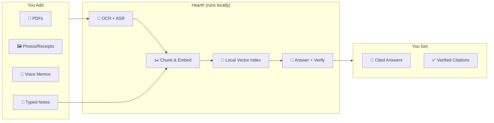

# Hearth — Fully Offline, On-Device AI Notes & Research Assistant

Drop in PDFs, receipts, voice memos, or typed notes. Ask questions. Get cited answers. Nothing ever leaves your machine.

## What Makes Hearth Different

Most AI assistants send your data to the cloud. Hearth runs **everything** on your own machine:

- **No account.** No signup, no login, no email required.
- **No API key.** Not one. All models run locally.
- **No data leaves your device.** Medical records, contracts, financial docs, therapy notes — they never touch a server.
- **No internet required.** After initial model download, wifi can stay off.
- **Actually private.** Even the "privacy-focused" cloud services train on your data. Hearth can't — there's nothing to send.

## How It Works



## Tech Stack

| Layer | Technology | Why |
|-------|-----------|-----|
| **Backend** | Python + FastAPI + Uvicorn | Blazing fast async server |
| **ML: LLM** | Qwen2.5-1.5B-Instruct via llama-cpp-python | Best-in-class local CPU inference |
| **ML: Verify** | Qwen3-0.6B via llama-cpp-python | Fast citation checking |
| **ML: ASR** | faster-whisper (CTranslate2) | 4× faster than OpenAI Whisper |
| **ML: OCR** | TrOCR via transformers (ONNX) | Printed text recognition |
| **ML: Embeddings** | gte-small via sentence-transformers | High-quality 384-dim vectors |
| **ML: NER** | spaCy | Lightning-fast PII detection |
| **Orchestration** | LangGraph (Python) | State-machine pipeline DAGs |
| **Vector Search** | SQLite + sqlite-vec | Zero-infra HNSW indexing |
| **Full-Text Search** | SQLite FTS5 | BM25 scoring, built-in |
| **Frontend** | React + Vite + Tailwind | Fast, modern, accessible |
| **State** | Zustand | TypeScript-first, minimal |
| **Packaging** | Docker Compose | One-command deploy |

## Model Profiles

| Profile | Generator | RAM Needed | Total Download |
|---------|-----------|:----------:|:--------------:|
| 🚀 **Fast** | Qwen3-0.6B | 8 GB | ~700 MB |
| ⚖️ **Balanced** (default) | Qwen2.5-1.5B | 8 GB | ~1.3 GB |
| 🎯 **Accurate** | Llama-3.2-3B | 16 GB | ~3 GB |

All profiles include the citation verification agent (Qwen3-0.6B) and the same OCR/ASR/embedding stack.

## Quick Start

### Docker (Recommended)

```bash
git clone https://github.com/your-org/hearth.git
cd hearth
docker compose up -d
# Open http://localhost:5173
```

First run walks you through a system check and model download (~2-5 minutes depending on profile).

### Manual (Python + Node)

```bash
# Backend
cd hearth
python -m venv .venv
.venv\Scripts\activate   # Windows
pip install -e ".[dev]"
uvicorn app.main:app --reload --port 8765

# Frontend (separate terminal, for dev)
cd hearth/static/frontend
npm install
npm run dev
# Open http://localhost:5173

# Or use the startup script (builds React + starts server):
.\scripts\start.ps1        # Windows
./scripts/start.sh         # Linux/macOS
```

## Features

### Input Types
- **📄 PDFs** — Extract text, embed, index (via PyMuPDF)
- **🖼️ Images** — OCR receipts, documents, handwritten notes (via TrOCR)
- **🎤 Audio** — Transcribe voice memos, meetings (via faster-whisper)
- **📝 Notes** — Write typed notes directly in the app

### Q&A Pipeline
- **Hybrid Search** — Vector similarity + BM25 full-text, weighted and merged
- **Cited Answers** — Every claim links back to the source chunk
- **Citation Verification** — A second LLM checks every citation before display
- **PII Redaction** — Toggle to detect and redact personal information
- **Streaming** — Tokens appear live as the model generates

### Document Management
- **Folder organization** — Tag and organize documents into virtual folders
- **Batch operations** — Multi-select, bulk delete, bulk reindex
- **Bulk export** — Download all data as a single archive
- **File preview** — Inline PDF, image, and audio previews
- **Version tracking** — Re-uploading updates version history

### App Features
- **Conversation branching** — Edit a past message → fork into a new thread
- **Command palette** — `Ctrl+K` for everything
- **Dark mode** — Respects system preference
- **Keyboard navigation** — Every action reachable via keyboard
- **Trace inspector** — Visual DAG of every pipeline run (Langfuse-style)
- **Model management** — Download, switch, and unload models without restart
- **Backup/Restore** — Export everything to a single archive file

## Keyboard Shortcuts

| Shortcut | Action |
|----------|--------|
| `Ctrl+K` | Search / command palette |
| `Ctrl+N` | New note |
| `Ctrl+Enter` | Send message |
| `Ctrl+Shift+C` | Clear conversation |
| `Ctrl+,` | Settings |
| `Escape` | Close panel |
| `Ctrl+Shift+P` | PII toggle |
| `Alt+1-9` | Switch conversation |

## Developer

### Project Structure

```
hearth/
├── .github/workflows/       # CI (backend + frontend)
├── app/
│   ├── api/                 # REST routers + Pydantic schemas
│   ├── services/            # Business logic layer
│   ├── models/              # ML model wrappers (whisper, trocr, embedding, ner)
│   ├── providers/           # Pluggable provider abstraction (ollama, openai, local, mock)
│   ├── pipeline/            # LangGraph ingestion workflows
│   ├── storage/             # SQLite schema, DB connection, repos, file store
│   └── core/                # Utilities (chunking, PII)
├── static/
│   └── frontend/            # React + Vite SPA
│       ├── src/
│       │   ├── api/         # Fetch client
│       │   ├── store/       # Zustand stores
│       │   ├── hooks/       # React hooks
│       │   ├── components/  # UI by domain
│       │   └── types/       # TypeScript interfaces
│       └── ...
├── scripts/                 # Dev & startup scripts
├── tests/                   # Backend unit + e2e tests
│   ├── e2e/                 # Journey-level tests
│   └── ...
├── data/                    # Runtime data (DB, uploads)
└── pyproject.toml
```

### Running Tests

```bash
# Backend tests
cd hearth
pytest tests/ -v

# Frontend checks
cd hearth/static/frontend
npm run lint
npm run typecheck
```

## CI Pipeline

Every push runs:
1. **Backend** — ruff lint, mypy, pytest on Ubuntu with Python 3.11
2. **Frontend** — npm ci, ESLint, TypeScript strict, Vite build

## License

MIT
