# Hearth — Fully Offline, On-Device Notes & Research Assistant

> **Status:** Design Document  
> **Date:** 2026-07-01  
> **Stack:** Python (FastAPI) + React (Vite) + LangGraph + local ML inference  
> **Repository:** [github.com/your-org/hearth](https://github.com/your-org/hearth)

---

## 1. Overview

Hearth is a fully offline, local-server-based notes & research assistant. Users drop in PDFs, photos of documents/receipts, voice memos, or typed notes. The system OCRs, transcribes, chunks, and embeds everything, then lets users ask questions and get cited, grounded answers — with a second local model checking the first one's citations before anything is shown. All data stays on the device. No cloud, no API keys, no telemetry.

### 1.1 The Problem It Solves

People have sensitive material — medical letters, contracts, financial documents, therapy notes, meeting recordings — they'd genuinely like an AI assistant for, but won't paste into ChatGPT/Claude because of privacy, compliance, or not wanting their data used for training. Enterprises in legal, healthcare, and defense have the same requirement: **zero-data-leave local AI**.

### 1.2 Core Principles

- **Zero data leaves the machine.** Ever.
- **Local-first.** Everything runs on the user's own hardware.
- **Full-grade application.** Not a demo, not an MVP. Production-quality error handling, UX, and extensibility.
- **Extensible.** Model backends, pipeline stages, and UI components are all swappable.

### 1.3 What It Is Not (Explicit Non-Goals)

- **No cloud sync** — No accounts, no multi-device sync.
- **No mobile app** — Responsive web, but primarily desktop/server.
- **No real-time collaboration** — Single-user only.
- **No plugin system** — Extensibility via model swapping and pipeline config.
- **No native desktop wrapper** — PWA + local server is sufficient.
- **No advanced RAG strategies** — No agentic loops, ReAct, or tool use in v1. Simple retrieve → generate → verify.

### 1.4 Hugging Face Tasks Used

| Task | Model | Purpose |
|------|-------|---------|
| Feature Extraction | gte-small | Embeddings for retrieval index |
| Text Generation | Qwen2.5-1.5B-Instruct | Answering user queries |
| Image-to-Text | TrOCR base-printed | OCR for scanned documents/receipts |
| Automatic Speech Recognition | faster-whisper base | Voice memo transcription |
| Token Classification | en_core_web_sm (spaCy) | PII redaction |
| Sentence Similarity | gte-small | Dedup + citation verification |

---

## 2. Architecture

### 2.1 High-Level Stack

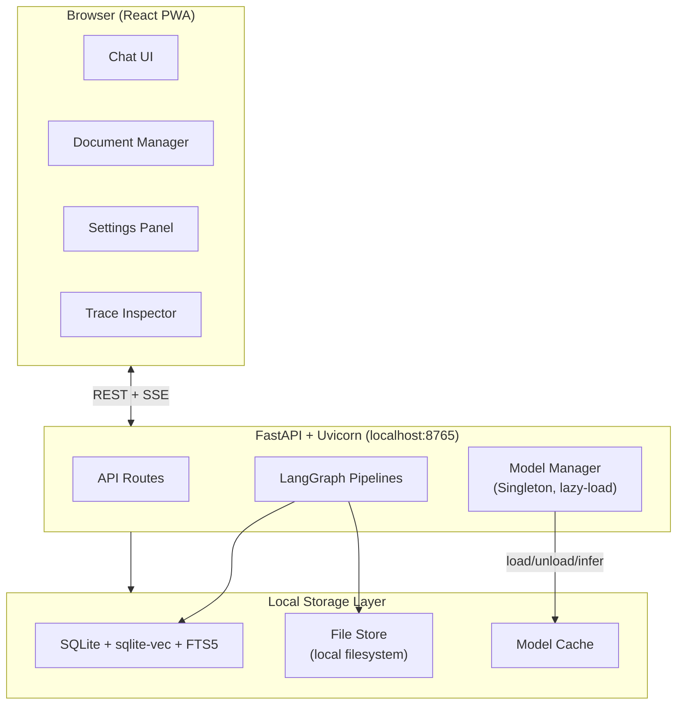

### 2.2 Performance Analysis: Why Python Backend

Every ML workload was analyzed across Python vs Node.js runtimes:

| Workload | Python Winner | Why |
|----------|--------------|-----|
| **ASR (Whisper)** | `faster-whisper` (CTranslate2) | 4× faster than Transformers.js. INT8 quantized, C++ backend. ~0.3× real-time factor. |
| **LLM Generation** | `llama-cpp-python` (GGUF) | 3-5× faster on CPU. AVX2/NEON optimized, mmap loading, Q4_K_M quantization. 15-25 tok/s vs 5-10 tok/s. |
| **Embeddings** | `sentence-transformers` (ONNX) | ~2× faster than Transformers.js. Full ONNX Runtime, not the web variant. |
| **OCR** | `transformers` (PyTorch/ONNX) | Full beam search support. GPU acceleration available. |
| **NER/PII** | `spaCy` (Cython) | Lightning-fast Cython backend. More model options. |
| **Vector Search** | `sqlite-vec` | Native SQLite extension vs WASM port. Zero overhead. |

**Verdict:** Python is **3-10× faster** across every inference workload. On a demo you need to feel snappy, this is the difference between "wow" and "it's thinking..."

### 2.3 Stack Components

| Layer | Technology | Rationale |
|-------|-----------|-----------|
| **Backend framework** | FastAPI + Uvicorn | Async, auto-docs, SSE support, fastest Python ASGI |
| **ML Inference** | llama-cpp-python, faster-whisper, sentence-transformers, spaCy | Native performance, not WASM-wrapped |
| **Pipeline orchestration** | LangGraph (Python) | State-machine DAGs, more mature than LangGraph.js |
| **Vector database** | SQLite + sqlite-vec extension | Single-file, zero-infra, HNSW-style indexes |
| **Full-text search** | SQLite FTS5 | BM25 scoring, built-in, no extra dependency |
| **Frontend** | React + Vite + Tailwind + Zustand | Industry standard, fast dev experience |
| **State management** | Zustand | TypeScript-first, minimal boilerplate |
| **Packaging** | Docker Compose | One-command deploy. Also supports pip install standalone |

### 2.4 Directory Structure

```
hearth/
├── backend/
│   ├── app/
│   │   ├── main.py                  # FastAPI app, CORS, static serving
│   │   ├── config.py                # Settings, paths, defaults
│   │   ├── api/
│   │   │   ├── documents.py         # Upload/list/delete/reindex
│   │   │   ├── chat.py              # Chat + streaming endpoint
│   │   │   ├── notes.py             # CRUD typed notes
│   │   │   ├── conversations.py     # Conversation CRUD
│   │   │   ├── search.py            # Hybrid search endpoint
│   │   │   ├── settings.py          # App settings
│   │   │   ├── models_api.py        # Model management
│   │   │   └── system.py            # Health, backup, export
│   │   ├── models/
│   │   │   ├── manager.py           # Lifecycle: load/unload/cache/benchmark
│   │   │   ├── whisper_model.py     # faster-whisper for ASR
│   │   │   ├── trocr_model.py       # TrOCR for OCR (ONNX)
│   │   │   ├── embedding_model.py   # sentence-transformers (ONNX)
│   │   │   ├── llm_model.py         # llama-cpp-python for generation
│   │   │   └── ner_model.py         # spaCy NER for PII detection
│   │   ├── pipeline/
│   │   │   ├── orchestrator.py      # LangGraph pipeline definition
│   │   │   ├── ingest_workflow.py   # File -> OCR/ASR -> chunk -> embed
│   │   │   ├── query_workflow.py    # Query -> retrieve -> generate -> verify
│   │   │   └── verify_agent.py      # Citation verification sub-graph
│   │   ├── storage/
│   │   │   ├── database.py          # SQLite + sqlite-vec + FTS5 setup
│   │   │   ├── repository.py        # Document/chunk/note/message repos
│   │   │   └── file_store.py        # Local filesystem management
│   │   └── core/
│   │       ├── chunking.py          # Text splitting strategies
│   │       └── pii.py               # PII detection & redaction
│   ├── tests/
│   │   ├── conftest.py
│   │   ├── test_api.py
│   │   ├── test_ingest.py
│   │   ├── test_query.py
│   │   ├── test_models.py
│   │   └── fixtures/
│   ├── models/                      # Downloaded model cache
│   ├── data/                        # User files, database
│   ├── requirements.txt
│   ├── pyproject.toml
│   └── Dockerfile
│
├── frontend/
│   ├── public/
│   │   ├── index.html
│   │   ├── manifest.json
│   │   └── icons/
│   ├── src/
│   │   ├── main.tsx
│   │   ├── App.tsx
│   │   ├── api/
│   │   │   ├── client.ts
│   │   │   └── types.ts
│   │   ├── components/
│   │   │   ├── layout/              # AppLayout, Header, Sidebar, StatusBar
│   │   │   ├── chat/                # ChatView, MessageBubble, ChatInput, StreamingText, CitationModal
│   │   │   ├── documents/           # DocumentList, DocumentItem, UploadZone, DocumentPreview
│   │   │   ├── notes/               # NoteEditor, NoteList
│   │   │   ├── settings/            # SettingsPanel, ModelManager, ModelProfileCard, TraceInspector
│   │   │   ├── search/              # SearchDialog, SearchResults
│   │   │   └── common/              # Button, Modal, Toast, Spinner, ProgressBar, EmptyState
│   │   ├── hooks/                   # useChat, useDocuments, useNotes, useSearch, useSettings, useKeyboard
│   │   ├── store/                   # chatStore, docStore, settingsStore (Zustand)
│   │   ├── types/index.ts
│   │   └── utils/                   # format.ts, shortcuts.ts
│   ├── index.html
│   ├── vite.config.ts
│   ├── tailwind.config.js
│   ├── tsconfig.json
│   ├── package.json
│   └── Dockerfile
│
├── eval/
│   ├── test_corpus/                 # 10-20 synthetic files + golden Q&A
│   ├── run_eval.py                  # Headless eval script
│   └── metrics.py                   # Hit rate, groundedness, faithfulness
│
├── scripts/
│   ├── download_models.py
│   ├── first_run.py
│   └── seed_test_data.py
│
├── docker-compose.yml
├── .github/workflows/ci.yml
├── .gitignore
├── README.md
└── LICENSE
```

---

## 3. Data Model & Database Schema

### 3.1 Entity Relationship Diagram

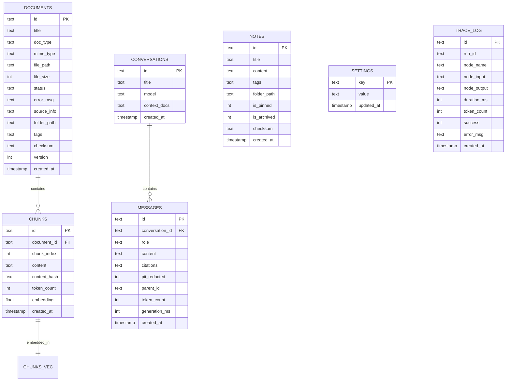

### 3.2 SQL Schema

```sql
-- Documents: every file ingested
CREATE TABLE documents (
    id          TEXT PRIMARY KEY,
    title       TEXT NOT NULL,
    doc_type    TEXT NOT NULL CHECK(doc_type IN ('pdf','image','audio','note','text')),
    mime_type   TEXT NOT NULL,
    file_path   TEXT NOT NULL,
    file_size   INTEGER NOT NULL,
    status      TEXT NOT NULL DEFAULT 'pending'
        CHECK(status IN ('pending','processing','ready','error')),
    error_msg   TEXT,
    source_info TEXT,               -- JSON: page count, duration, dimensions
    folder_path TEXT DEFAULT '/',   -- Virtual folder for organization
    tags        TEXT DEFAULT '[]',
    checksum    TEXT,               -- SHA-256 for dedup
    version     INTEGER DEFAULT 1,
    created_at  TIMESTAMP DEFAULT CURRENT_TIMESTAMP,
    updated_at  TIMESTAMP DEFAULT CURRENT_TIMESTAMP
);

-- Chunks: text fragments after ingestion
CREATE TABLE chunks (
    id              TEXT PRIMARY KEY,
    document_id     TEXT NOT NULL REFERENCES documents(id) ON DELETE CASCADE,
    chunk_index     INTEGER NOT NULL,
    content         TEXT NOT NULL,
    content_hash    TEXT NOT NULL,
    token_count     INTEGER NOT NULL,
    embedding        FLOAT32[384],    -- sqlite-vec column
    created_at      TIMESTAMP DEFAULT CURRENT_TIMESTAMP
);
CREATE INDEX idx_chunks_doc_id ON chunks(document_id);

-- Vector index (sqlite-vec)
CREATE VIRTUAL TABLE chunks_vec USING vec0(
    embedding FLOAT32[384] distance_metric=cosine
);

-- Full-text search (FTS5)
CREATE VIRTUAL TABLE chunks_fts USING fts5(
    content, document_id UNINDEXED,
    tokenize='porter unicode61'
);

-- Notes: user-created typed notes
CREATE TABLE notes (
    id          TEXT PRIMARY KEY,
    title       TEXT NOT NULL,
    content     TEXT NOT NULL,
    tags        TEXT DEFAULT '[]',
    folder_path TEXT DEFAULT '/',
    is_pinned   INTEGER DEFAULT 0,
    is_archived INTEGER DEFAULT 0,
    checksum    TEXT,
    created_at  TIMESTAMP DEFAULT CURRENT_TIMESTAMP,
    updated_at  TIMESTAMP DEFAULT CURRENT_TIMESTAMP
);

-- Conversations
CREATE TABLE conversations (
    id       TEXT PRIMARY KEY,
    title    TEXT NOT NULL,
    model    TEXT,
    context_docs TEXT DEFAULT '[]',
    created_at TIMESTAMP DEFAULT CURRENT_TIMESTAMP,
    updated_at TIMESTAMP DEFAULT CURRENT_TIMESTAMP
);

-- Messages
CREATE TABLE messages (
    id              TEXT PRIMARY KEY,
    conversation_id TEXT NOT NULL REFERENCES conversations(id) ON DELETE CASCADE,
    role            TEXT NOT NULL CHECK(role IN ('user','assistant','system')),
    content         TEXT NOT NULL,
    citations       TEXT,
    pii_redacted    INTEGER DEFAULT 0,
    parent_id       TEXT,             -- For conversation branching
    token_count     INTEGER,
    generation_ms   INTEGER,
    created_at      TIMESTAMP DEFAULT CURRENT_TIMESTAMP
);
CREATE INDEX idx_messages_conv ON messages(conversation_id);

-- Key-value settings
CREATE TABLE settings (
    key        TEXT PRIMARY KEY,
    value      TEXT NOT NULL,
    updated_at TIMESTAMP DEFAULT CURRENT_TIMESTAMP
);

-- Pipeline traces (self-hosted observability)
CREATE TABLE trace_log (
    id          TEXT PRIMARY KEY,
    run_id      TEXT NOT NULL,
    node_name   TEXT NOT NULL,
    node_input  TEXT,
    node_output TEXT,
    duration_ms INTEGER,
    token_count INTEGER,
    success     INTEGER DEFAULT 1,
    error_msg   TEXT,
    created_at  TIMESTAMP DEFAULT CURRENT_TIMESTAMP
);
CREATE INDEX idx_trace_run ON trace_log(run_id);
```

### 3.3 Hybrid Search Strategy

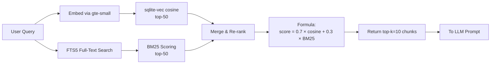

---

## 4. Model Configuration

### 4.1 Recommended Models

| Task | Model | Backend | Quantization | Size | Speed |
|------|-------|---------|:------------:|:----:|:-----:|
| **LLM Generation** | Qwen2.5-1.5B-Instruct | llama-cpp-python (GGUF) | Q4_K_M | ~900 MB | 15-25 tok/s |
| **Citation Verify** | Qwen3-0.6B-Instruct | llama-cpp-python (GGUF) | Q4_K_M | ~400 MB | 30-40 tok/s |
| **Embeddings** | gte-small | sentence-transformers (ONNX) | INT8 | ~60 MB | ~50 docs/s |
| **ASR** | faster-whisper base | CTranslate2 | INT8 | ~140 MB | ~0.3× RTF |
| **OCR** | TrOCR base-printed | transformers (ONNX) | FP32 | ~120 MB | ~1-3s/page |
| **NER/PII** | en_core_web_sm | spaCy | FP32 | ~50 MB | ~10ms/doc |

**Total for Balanced profile: ~1.3 GB** of model storage.

### 4.2 Model Profiles

Users choose a profile during first-run setup and can switch later:

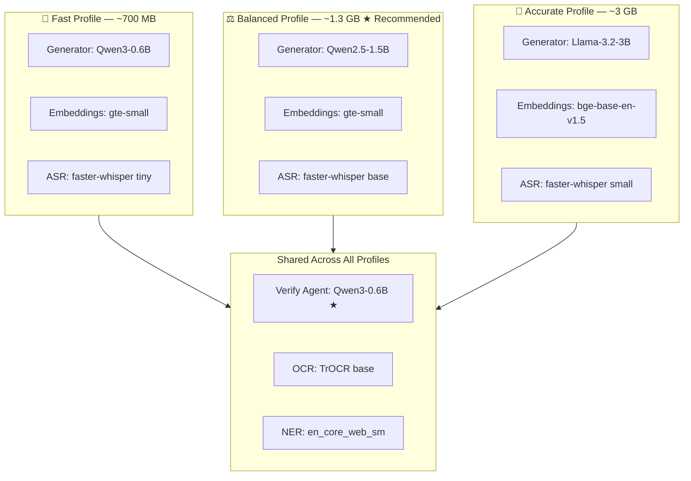

| Profile | Generator | Embeddings | ASR | Total Size | Min RAM | Recommended For |
|---------|-----------|------------|-----|:----------:|:-------:|-----------------|
| **Fast** | Qwen3-0.6B | gte-small | whisper tiny | ~700 MB | 8 GB | Low-RAM devices, older hardware |
| **Balanced** | Qwen2.5-1.5B | gte-small | whisper base | ~1.3 GB | 8 GB | Mainstream laptops (default) |
| **Accurate** | Llama-3.2-3B | bge-base | whisper small | ~3 GB | 16 GB | Workstations, gaming PCs |

> Qwen3-0.6B is the dedicated **verify agent** in all profiles. It runs the citation-verification sub-graph after the main generator produces an answer. This is the key differentiator — two-model verification ensures no hallucinated claims reach the user unchecked.

### 4.3 Model Manager Architecture

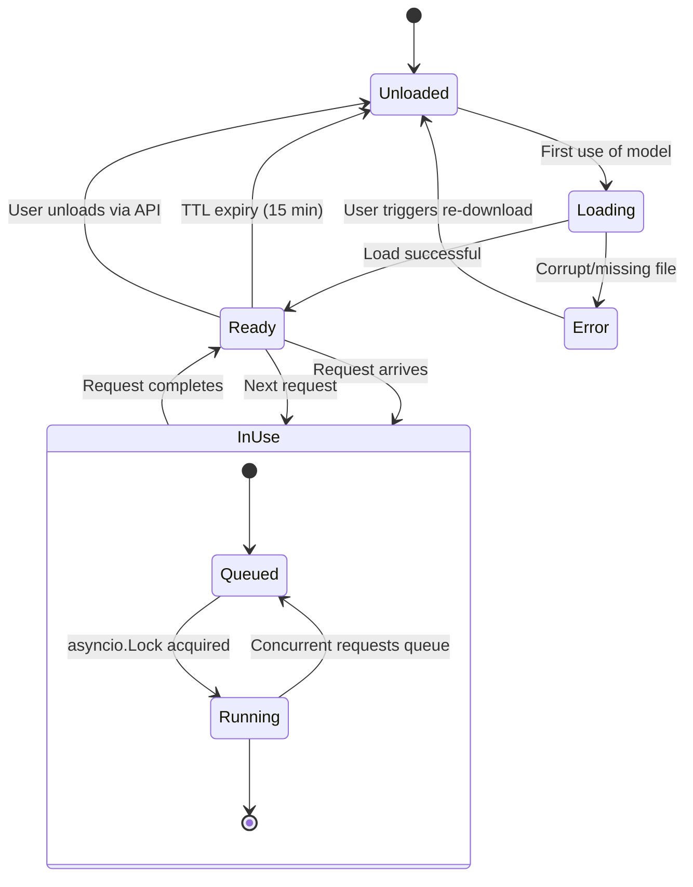

**ModelManager capabilities:**
- **Lazy loading** — Models load on first use. Generator loads on first query. ASR loads on first audio upload. Zero startup cost.
- **TTL caching** — Models unload after 15 minutes of inactivity. Configurable per model.
- **Explicit unload** — API endpoint instantly unloads any model to free memory.
- **Concurrent access** — Thread-safe with `asyncio.Lock` per model. Requests queue gracefully.
- **Benchmark** — On first run, quick benchmark measures tok/s and recommends the optimal profile.

---

## 5. Pipeline Design (LangGraph)

Hearth uses **LangGraph (Python)** to define state-machine workflows. Each node is a Python function, edges define the flow, and the shared state object persists across the graph.

### 5.1 Ingestion Pipeline

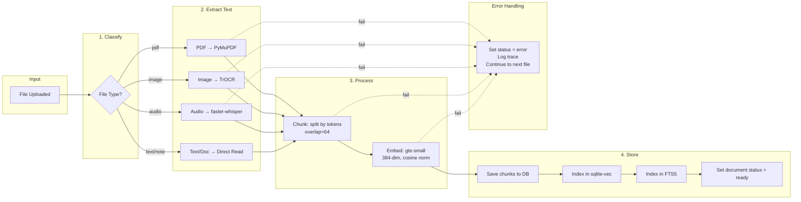

**LangGraph State:**
```python
class IngestionState(TypedDict):
    document_id: str
    file_path: str
    doc_type: Literal["pdf", "image", "audio", "note", "text"]
    status: str
    chunks: list[dict]
    errors: list[str]
```

**Nodes:** `classify_file` → `extract_text` → `chunk_text` → `embed_chunks` → `store_chunks`  
**Edge type:** Sequential with conditional error edges (→ `handle_error` → terminate)

### 5.2 Query Pipeline

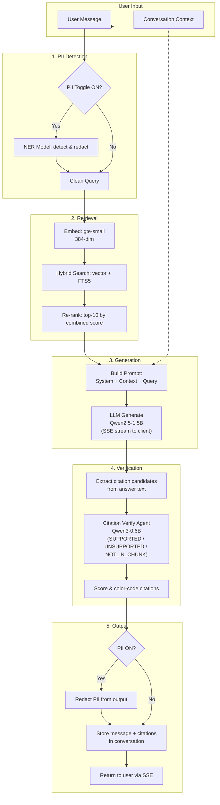

**LangGraph State:**
```python
class QueryState(TypedDict):
    query: str
    context_docs: list[str]
    redacted_query: str | None
    embedded_query: list[float]
    retrieved_chunks: list[Chunk]
    prompt: str
    answer: str
    citations: list[Citation]
    verified_citations: list[VerifiedCitation]
    pii_redacted: bool
    conversation_id: str
    trace: list[TraceStep]
```

### 5.3 Citation Verification Sub-Graph

The differentiator: a second, smaller LLM checks every citation before anything reaches the user.

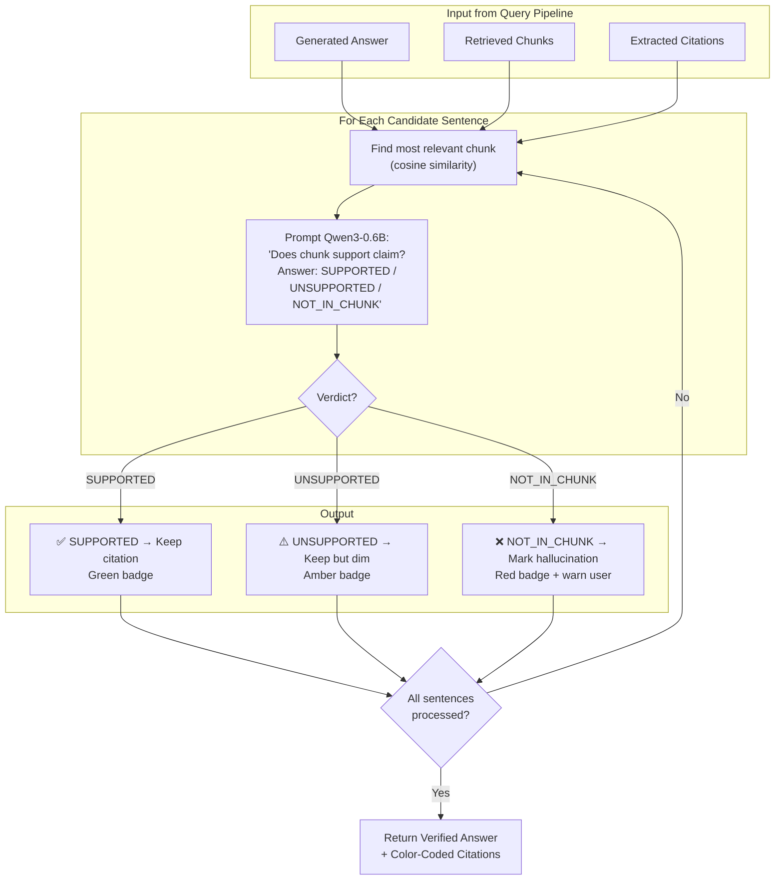

**Verify Agent Prompt Template:**
```
You are a citation verification assistant. Your job is to check if a chunk of text
supports a specific claim.

Chunk text: <chunk_content>

Claim: <sentence_from_answer>

Does the chunk text support this claim? Answer with exactly one word:
- SUPPORTED (the chunk directly supports this claim)
- UNSUPPORTED (the chunk mentions this topic but doesn't fully support the claim)
- NOT_IN_CHUNK (the claim cannot be found in or inferred from the chunk)

Answer:
```

### 5.4 PII Redaction Flow

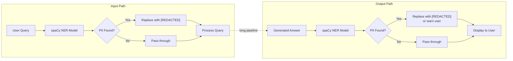

PII toggle in the header controls the entire flow. When OFF, NER is completely bypassed (zero overhead).

---

## 6. API Reference

### 6.1 Complete Endpoint Map

| Method | Path | Description |
|--------|------|-------------|
| **Documents** |||
| `POST` | `/api/documents/upload` | Upload file(s). Multipart. Returns `{id, title, status}` |
| `GET` | `/api/documents` | List all documents. Query: `status`, `doc_type`, `folder`, `tags`, `page` |
| `GET` | `/api/documents/{id}` | Get document details |
| `DELETE` | `/api/documents/{id}` | Delete document + chunks + file. 204 |
| `POST` | `/api/documents/{id}/reindex` | Re-run ingestion on a document |
| `POST` | `/api/documents/batch-delete` | Delete multiple documents by ID array |
| `PUT` | `/api/documents/{id}` | Update metadata (tags, folder, title) |
| `GET` | `/api/documents/{id}/preview` | Stream file content for preview |
| **Notes** |||
| `GET` | `/api/notes` | List notes. Filters: `folder`, `tags`, `archived`, `page` |
| `POST` | `/api/notes` | Create a note |
| `GET` | `/api/notes/{id}` | Get single note |
| `PUT` | `/api/notes/{id}` | Update note |
| `DELETE` | `/api/notes/{id}` | Delete note |
| **Conversations** |||
| `GET` | `/api/conversations` | List conversations |
| `POST` | `/api/conversations` | Create new conversation |
| `DELETE` | `/api/conversations/{id}` | Delete conversation + messages |
| `GET` | `/api/conversations/{id}/messages` | Get paginated messages |
| `PUT` | `/api/conversations/{id}` | Update title, context docs |
| **Chat** |||
| `POST` | `/api/chat` | Send message. Body: `{query, conversation_id, context_docs}`. Returns SSE |
| `POST` | `/api/chat/regenerate` | Regenerate last assistant message |
| `POST` | `/api/chat/branch` | Edit a past message → fork conversation |
| **Search** |||
| `GET` | `/api/search` | Hybrid search. Query: `q`, `type`, `folder`, `tags`, `page` |
| **Models** |||
| `GET` | `/api/models/status` | Status: loaded models, memory, last-used |
| `POST` | `/api/models/unload/{name}` | Unload model to free memory |
| `GET` | `/api/models/profiles` | Available profiles with size/capability |
| `POST` | `/api/models/profile` | Switch active profile |
| `GET` | `/api/models/downloads` | List downloadable models |
| `POST` | `/api/models/download` | Download model from HuggingFace (SSE progress) |
| `GET` | `/api/models/download/{task_id}/status` | Check download progress |
| **System** |||
| `GET` | `/api/system/health` | Health: DB, models, disk space |
| `POST` | `/api/system/backup` | Create backup archive |
| `POST` | `/api/system/restore` | Restore from archive |
| `GET` | `/api/system/logs` | Recent trace logs |
| **Settings** |||
| `GET` | `/api/settings` | All settings |
| `PUT` | `/api/settings` | Update settings |

### 6.2 Streaming Protocol (SSE)

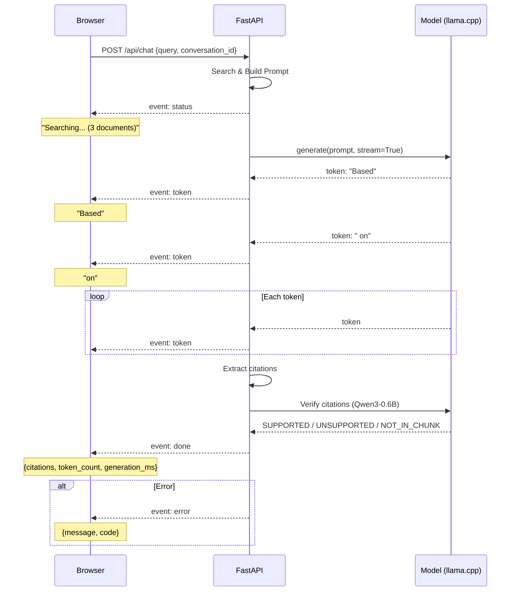

**SSE Event Types:**

```
event: status
data: {"status": "searching", "documents": 3}

event: status
data: {"status": "generating"}

event: token
data: {"token": "Based"}

event: token
data: {"token": " on"}

event: done
data: {
  "citations": [
    {"id": "chunk_1", "doc_title": "insurance_letter.pdf", "text": "The coverage limit...",
     "score": 0.92, "verified": true, "color": "green"},
    {"id": "chunk_2", "doc_title": "contract.pdf", "text": "The parties agree...",
     "score": 0.78, "verified": false, "color": "amber"}
  ],
  "token_count": 342,
  "generation_ms": 8900,
  "conversation_id": "abc-123"
}

event: error
data: {"message": "Model failed to load", "code": "MODEL_LOAD_ERROR"}
```

---

## 7. Frontend Architecture

### 7.1 Layout

```
┌──────────────────────────────────────────────────────────────┐
│  Header                                                        │
│  🔥 Hearth    [Search 🔍]  [PII Toggle 🛡️]  [Settings ⚙️]    │
├──────────────┬───────────────────────────────────────────────┤
│              │                                               │
│  Sidebar     │   Main Content Area                           │
│              │   ┌──────────────────────────────────────┐    │
│  📄 Documents│   │  Chat View / Note Editor / Preview   │    │
│    ├─ Folder1│   │                                      │    │
│    │  ├─ Doc1│   │  ┌──────────────────────────────┐   │    │
│    │  ├─ Doc2│   │  │ Message with citations       │   │    │
│    └─ ...    │   │  │ According to the contract[1] │   │    │
│              │   │  │ the coverage limit is... [2]  │   │    │
│  📝 Notes    │   │  └──────────────────────────────┘   │    │
│    ├─ Note1  │   │                                      │    │
│    └─ ...    │   │  ┌──────────────────────────────┐   │    │
│              │   │  │ [Type your question...]  [➤] │   │    │
│  💬 Chats   │   │  │ [📎 Attach] [🎤 Voice]       │   │    │
│    ├─ Chat1  │   │  └──────────────────────────────┘   │    │
│    └─ ...    │   └──────────────────────────────────────┘    │
│              │                                               │
├──────────────┴───────────────────────────────────────────────┤
│  Status Bar:  ◉ Qwen2.5-1.5B loaded  |  🖥 3.2 GB / 16 GB   │
└──────────────────────────────────────────────────────────────┘
```

### 7.2 Component Tree

```
App
├── AppLayout
│   ├── Header
│   │   ├── AppTitle
│   │   ├── PiiToggle
│   │   ├── SearchButton (Ctrl+K)
│   │   └── SettingsButton
│   ├── Sidebar
│   │   ├── FolderTree
│   │   ├── DocumentList
│   │   │   └── DocumentItem[] (status badge, type icon, size)
│   │   ├── NoteList
│   │   │   └── NoteItem[]
│   │   └── ConversationList
│   │       └── ConversationItem[]
│   ├── MainContent
│   │   ├── ChatView (or NoteEditor or DocumentPreview)
│   │   │   ├── MessageList
│   │   │   │   └── MessageBubble[]
│   │   │   │       ├── StreamingText
│   │   │   │       └── CitationBadge[]
│   │   │   └── ChatInput
│   │   │       ├── TextArea
│   │   │       ├── AttachButton
│   │   │       ├── VoiceButton
│   │   │       └── SendButton
│   │   └── EmptyState
│   ├── StatusBar
│   │   ├── ModelIndicator
│   │   ├── MemoryIndicator
│   │   └── ActivityIndicator
│   ├── SettingsPanel (slide-over)
│   │   ├── ModelManager
│   │   │   └── ModelProfileCard[]
│   │   ├── GeneralSettings
│   │   └── TraceInspector
│   ├── SearchDialog (Ctrl+K modal)
│   │   └── SearchResults
│   ├── CitationModal
│   └── ToastContainer
```

### 7.3 State Management (Zustand)

```typescript
// Chat Store
interface ChatStore {
  conversations: Conversation[];
  activeConversationId: string | null;
  messages: Message[];
  isStreaming: boolean;
  streamBuffer: string;               // Accumulated tokens
  statusMessage: string | null;       // "Searching...", "Generating..."
  error: string | null;

  sendMessage: (query: string) => Promise<void>;
  regenerate: () => Promise<void>;
  selectConversation: (id: string) => Promise<void>;
  clearConversation: () => Promise<void>;
}

// Document Store
interface DocStore {
  documents: Document[];
  selectedDoc: Document | null;
  uploadProgress: Record<string, number>;
  isUploading: boolean;

  uploadFiles: (files: File[]) => Promise<void>;
  deleteDocument: (id: string) => Promise<void>;
  reindexDocument: (id: string) => Promise<void>;
}

// Settings Store
interface SettingsStore {
  settings: AppSettings;
  modelStatus: ModelStatus | null;
  isLoading: boolean;

  updateSettings: (partial: Partial<AppSettings>) => Promise<void>;
  switchProfile: (profile: string) => Promise<void>;
}
```

### 7.4 UI States (Every Component, Every State)

| Component | States |
|-----------|--------|
| **ChatView** | `empty` (welcome + prompt examples) → `streaming` (live tokens) → `complete` (rendered with citations) → `error` (retry) |
| **MessageBubble** | `sent` → `streaming` → `complete` → `error` |
| **UploadZone** | `idle` → `dragging` → `uploading` (progress) → `processing` (per-step status) → `done` / `error` |
| **DocumentItem** | `pending` → `processing` (spinner) → `ready` (clickable) → `error` (tooltip) |
| **SearchDialog** | `closed` → `open-empty` → `open-results` → `open-no-results` |
| **ModelManager** | `idle` → `downloading` (progress) → `ready` → `error` |
| **SettingsPanel** | `closed` → `open` (tabs: general / models / traces) |

### 7.5 Keyboard Shortcuts

| Shortcut | Action |
|----------|--------|
| `Ctrl+K` | Toggle search / command palette |
| `Ctrl+N` | New note |
| `Ctrl+Enter` | Send message |
| `Ctrl+Shift+C` | Clear current conversation |
| `Ctrl+,` | Open settings |
| `Escape` | Close modal / panel / search |
| `↑` (at empty input) | Edit last message |
| `Ctrl+Shift+U` | Upload file dialog |
| `Ctrl+Shift+P` | PII toggle |
| `Alt+1-9` | Switch to conversation N |

### 7.6 Accessibility

- All interactive elements have ARIA labels
- Live regions (`aria-live="polite"`) for streaming content
- Full keyboard navigation with visible focus indicators
- Respects `prefers-color-scheme` (dark mode)
- Respects `prefers-reduced-motion`
- Font sizing respects system settings
- Screen reader announcements for status changes

---

## 8. Error Handling Strategy

### 8.1 Server Error Matrix

| Scenario | Detection | Response |
|----------|-----------|----------|
| Model file missing | Startup check / lazy load | SSE error: `MODEL_NOT_FOUND`. Suggest download. |
| OOM during inference | `llama.cpp` OOM code | Unload largest model. Suggest smaller profile. |
| Corrupted model | Load fails / checksum mismatch | Suggest re-download. Show button in UI. |
| DB corruption | `PRAGMA integrity_check` fails | Auto-restore from backup. Log warning. |
| Disk full | Write fails | Check before ingestion. Show warning. |
| Unsupported file | MIME validation | Return 400 with supported formats. |
| Concurrent access | Per-model lock | Auto-queued. User sees slight delay. |
| Pipeline failure | Per-node error handling | Set doc `status=error`, log trace, continue. |
| Server startup fail | Port in use / config invalid | Show clear CLI error with fix suggestion. |

### 8.2 Client Error Handling

- **Global error boundary** — Catches unhandled React errors. Shows "Something went wrong" with reload.
- **Toast notifications** — Non-blocking errors (upload failed, search failed) with retry action.
- **Retry logic** — API client retries 3× with exponential backoff on network errors.
- **Offline detection** — If server unreachable, show "Server offline" overlay with reconnect button.

### 8.3 Graceful Shutdown

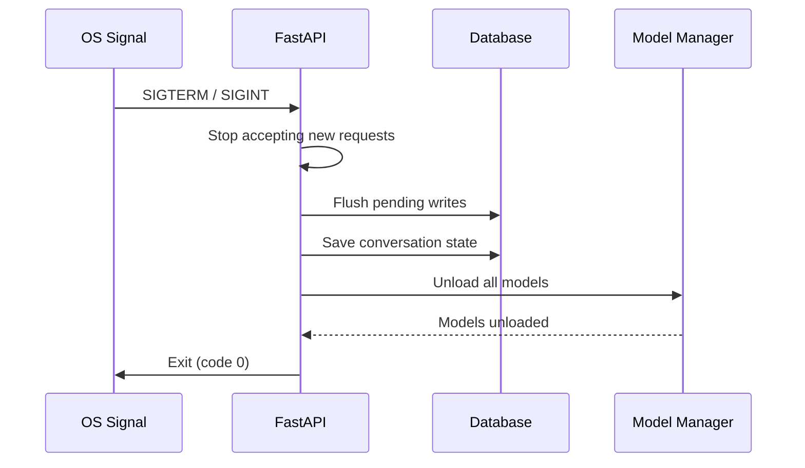

---

## 9. Testing Strategy

### 9.1 Test Pyramid

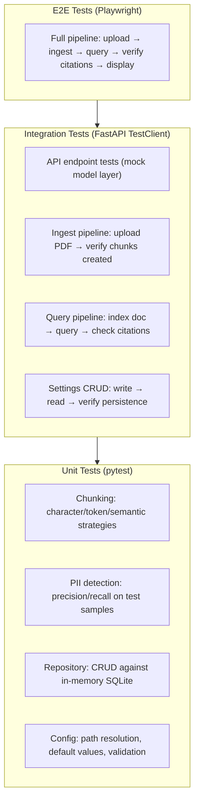

### 9.2 CI Eval Harness

A fixed test corpus with golden Q&A pairs runs in CI to guard against regressions:

```
eval/
  test_corpus/
    documents/
      insurance_letter.pdf       # Medical insurance coverage terms
      meeting_notes.txt          # Product roadmap discussion
      receipt.jpg                # Store receipt with PII
      doctor_note.pdf            # Medical diagnosis (sensitive)
      contract.txt               # Lease agreement
      voice_memo.wav             # Meeting recording
      ...
    golden_qa.json               # {"q": "...", "a": "...", "relevant_chunks": ["..."], "pii_check": bool}
    expected_scores.json          # Minimum thresholds for all metrics
  run_eval.py                    # Headless runner
  metrics.py                     # Metric definitions
```

**Metrics Collected:**

| Metric | Definition | Threshold |
|--------|-----------|:---------:|
| **Retrieval Hit Rate** | % of golden chunks in top-10 | ≥ 0.85 |
| **Faithfulness** | % of claims supported by chunks | ≥ 0.90 |
| **Answer Relevance** | Cos-sim(query, answer embedding) | ≥ 0.70 |
| **PII Precision** | Correct redaction / total redactions | ≥ 0.95 |
| **PII Recall** | Correct redaction / total PII present | ≥ 0.90 |
| **Latency p95** | End-to-end query time (seconds) | ≤ 30s |
| **Model Speed** | Tokens/sec for generator | Report only |

**CI Behavior:** If any metric drops below threshold, CI fails and the artifact shows the regression.

---

## 10. Docker & Deployment

### 10.1 Docker Compose

```yaml
services:
  backend:
    build: ./backend
    ports:
      - "8765:8765"
    volumes:
      - hearth-data:/app/data
      - hearth-models:/app/models
    environment:
      - HEARTH_HOST=0.0.0.0
      - HEARTH_PORT=8765
      - HEARTH_DATA_DIR=/app/data
      - HEARTH_MODELS_DIR=/app/models
    restart: unless-stopped
    healthcheck:
      test: curl -f http://localhost:8765/api/system/health
      interval: 30s
      timeout: 10s
      retries: 3

  frontend:
    build: ./frontend
    ports:
      - "5173:5173"
    depends_on:
      - backend
    environment:
      - VITE_API_URL=http://localhost:8765
    restart: unless-stopped

volumes:
  hearth-data:
  hearth-models:
```

### 10.2 Backend Dockerfile

```dockerfile
FROM python:3.12-slim

RUN apt-get update && apt-get install -y --no-install-recommends \
    build-essential \
    curl \
    ffmpeg \
    libsndfile1 \
    && rm -rf /var/lib/apt/lists/*

WORKDIR /app

COPY pyproject.toml requirements.txt ./
RUN pip install --no-cache-dir -r requirements.txt

COPY app/ ./app/

EXPOSE 8765

HEALTHCHECK --interval=30s --timeout=10s --retries=3 \
    CMD curl -f http://localhost:8765/api/system/health || exit 1

CMD ["uvicorn", "app.main:app", "--host", "0.0.0.0", "--port", "8765"]
```

### 10.3 Frontend Dockerfile

```dockerfile
FROM node:20-alpine AS builder
WORKDIR /app
COPY package.json package-lock.json ./
RUN npm ci
COPY . .
RUN npm run build

FROM nginx:alpine
COPY --from=builder /app/dist /usr/share/nginx/html
COPY nginx.conf /etc/nginx/conf.d/default.conf
EXPOSE 5173
CMD ["nginx", "-g", "daemon off;"]
```

### 10.4 Deployment Architecture

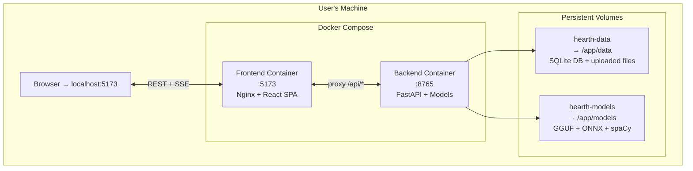

### 10.5 Shipping Options

| Method | Command | Best For |
|--------|---------|----------|
| **Docker Compose** | `docker compose up -d` | Users with Docker; enterprises |
| **pip install** | `pip install hearth && hearth serve` | Python users |
| **Standalone binary** | Download from releases | Non-technical users |
| **Raspberry Pi** | Docker on Pi 5 with USB SSD | Always-on home server |

---

## 11. GitHub CI Workflow

```yaml
name: CI

on:
  push:
    branches: [main]
  pull_request:
    branches: [main]

jobs:
  test:
    runs-on: ubuntu-latest
    steps:
      - uses: actions/checkout@v4

      - name: Set up Python 3.12
        uses: actions/setup-python@v5
        with:
          python-version: "3.12"
          cache: pip

      - name: Install backend deps
        working-directory: ./backend
        run: pip install -r requirements.txt

      - name: Run backend unit + integration tests
        working-directory: ./backend
        run: pytest tests/ -v --cov=app --cov-report=term --cov-report=xml

      - name: Set up Node 20
        uses: actions/setup-node@v4
        with:
          node-version: "20"
          cache: npm
          cache-dependency-path: ./frontend/package-lock.json

      - name: Install frontend deps
        working-directory: ./frontend
        run: npm ci

      - name: Lint + type-check frontend
        working-directory: ./frontend
        run: |
          npm run lint
          npm run typecheck

  eval:
    runs-on: ubuntu-latest
    needs: test
    steps:
      - uses: actions/checkout@v4

      - name: Set up Python 3.12
        uses: actions/setup-python@v5
        with:
          python-version: "3.12"

      - name: Install deps (including model deps)
        working-directory: ./backend
        run: pip install -r requirements.txt

      - name: Cache models
        id: cache-models
        uses: actions/cache@v4
        with:
          path: ./backend/models/
          key: models-${{ hashFiles('eval/test_corpus/golden_qa.json') }}

      - name: Download eval models
        if: steps.cache-models.outputs.cache-hit != 'true'
        working-directory: ./backend
        run: python ../scripts/download_models.py --minimal

      - name: Run eval harness
        working-directory: ./eval
        run: |
          python run_eval.py --corpus test_corpus/ --backend-python ../backend
          # Fails if metrics below expected_scores.json thresholds

      - name: Upload eval results
        uses: actions/upload-artifact@v4
        with:
          name: eval-results
          path: eval/results/
```

### CI Pipeline Flow

```mermaid
flowchart LR
    PUSH["git push"] --> CHECKOUT["Checkout"]
    CHECKOUT --> PYTHON["Setup Python 3.12"]
    PYTHON --> INSTALL_DEPS["Install pip deps"]
    INSTALL_DEPS --> UNIT["Run: pytest (unit + integration)"]
    UNIT --> NODE["Setup Node 20"]
    NODE --> INSTALL_NPM["npm ci"]
    INSTALL_NPM --> LINT["Run: lint + typecheck"]

    LINT --> EVAL_JOB["Eval Job (needs: test)"]
    EVAL_JOB --> CACHE{"Models cached?"}
    CACHE -->|Yes| RUN_EVAL["Run eval harness"]
    CACHE -->|No| DOWNLOAD["Download models"]
    DOWNLOAD --> RUN_EVAL
    RUN_EVAL --> FAIL{"Metrics > thresholds?"}
    FAIL -->|Yes| PASS["✅ CI Passes"]
    FAIL -->|No| FAIL_CI["❌ CI Fails<br/>Artifact: regression report"]
```

---

## 12. First-Run Experience

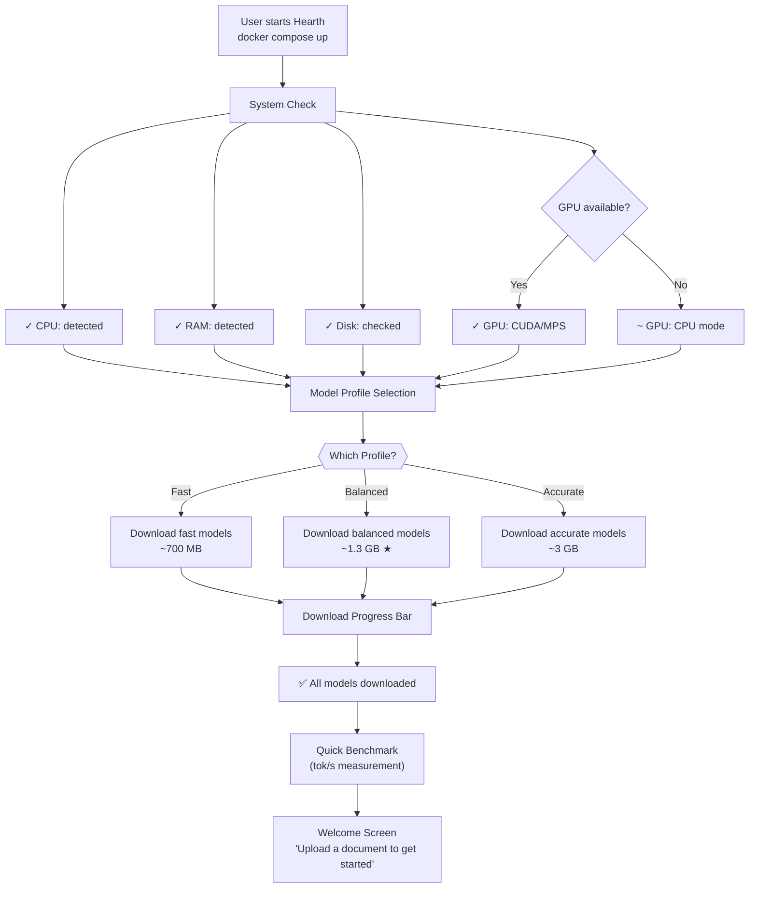

---

## 13. Implementation Phasing

| Phase | Scope | Deliverables | Est. Time |
|-------|-------|-------------|:---------:|
| **1 — Foundation** | Backend scaffold, DB schema, API skeleton, frontend scaffold + layout | Working shell: server starts, UI loads, DB initialized | ~3 days |
| **2 — Ingestion** | File upload, model integration (OCR/ASR/chunking/embedding), doc management | Can upload files, see them processed, view in sidebar | ~5 days |
| **3 — Chat** | Query pipeline, LLM integration, streaming, citation verify agent | Can ask questions, get streamed answers with verified citations | ~5 days |
| **4 — Polish** | UI refinement, error handling, keyboard shortcuts, PII toggle, accessibility | Full app feel: keyboard nav, dark mode, PII, error boundaries | ~4 days |
| **5 — Infrastructure** | Docker, CI workflow, eval harness, backup/restore, first-run wizard | docker compose up works; CI runs tests + eval on push | ~3 days |
| **Total** | | | **~20 days** |

---

## 14. Technology Choices — Summary

| Concern | Choice | Why Not The Alternative |
|---------|--------|------------------------|
| **Backend language** | Python | 3-10× faster inference than Node.js. Vast ML ecosystem. |
| **Backend framework** | FastAPI | Auto-docs, SSE, async, fastest Python ASGI. |
| **ML: LLM** | llama-cpp-python (GGUF) | Best CPU inference. AVX2/NEON. Q4_K_M. mmap loading. |
| **ML: ASR** | faster-whisper (CTranslate2) | 4× faster than OpenAI Whisper. INT8. |
| **ML: Embeddings** | sentence-transformers (ONNX) | 2× faster than Transformers.js. |
| **ML: OCR** | TrOCR (transformers/ONNX) | Accurate printed text. Supports beam search. |
| **ML: NER** | spaCy | Fastest CPU NER. Cython backend. |
| **Pipeline orchestration** | LangGraph (Python) | State-machine DAGs. More mature than LangGraph.js. |
| **Vector database** | SQLite + sqlite-vec | Zero-infra single file. HNSW-style indexes. |
| **Full-text search** | SQLite FTS5 | Built-in BM25. No extra dependency. |
| **Frontend** | React + Vite + Tailwind | Industry standard. Fast HMR. Portfolio signal. |
| **State management** | Zustand | TypeScript-first. Minimal boilerplate. No providers. |
| **Storage** | Local filesystem + SQLite | No infra. Simple backup = copy folder. |
| **Packaging** | Docker Compose | One command. Also supports pip/pyinstaller. |

---

## 15. Security & Privacy

- **No telemetry.** Zero outbound connections from the application.
- **No analytics.** No trackers, no usage data, no crash reporters.
- **No user accounts.** No emails, no passwords, no session tokens.
- **PII redaction toggle.** When ON, both input and output run through NER before storing.
- **All data local.** Documents, database, models — all in `~/.hearth/`.
- **Model downloads are opt-in.** User chooses which models to download. HuggingFace is only contacted on explicit "Download" action.
- **Graceful shutdown.** Flushes all state before exit. No data loss.

---

*This document is the authoritative design reference for the Hearth project. All implementation decisions should reference this spec.*
